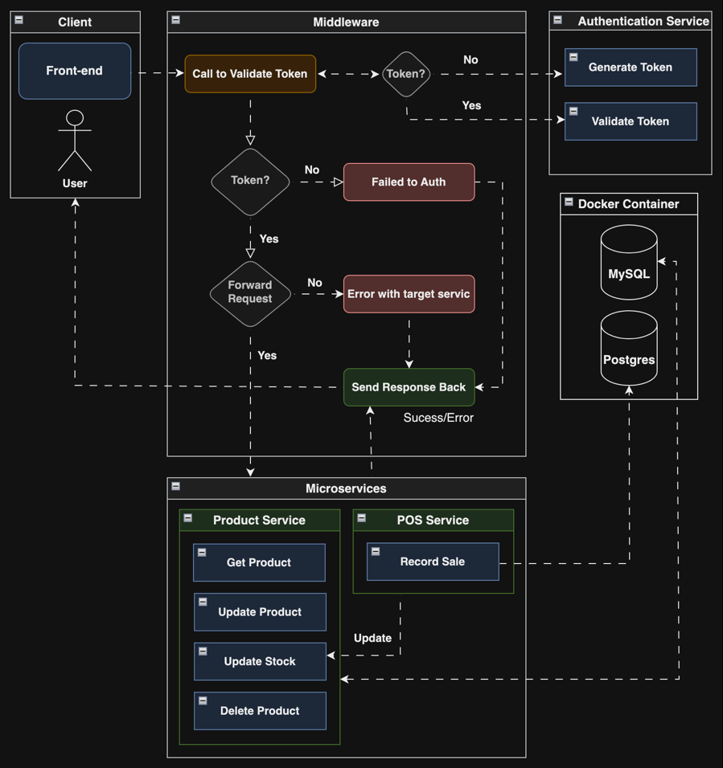

# Fullstack Microservices
## 🎯 Overview

## 🛠️ Tech Stack
## ✨ Key Features
## 📬 Backend
## 🤖 Frontend

## 📦 Database Schema
### - MySQL Schema
  ```sql
CREATE TABLE `tbl_product` (
  `id` bigint(20) unsigned NOT NULL AUTO_INCREMENT,
  `code` varchar(255) NOT NULL,
  `name` varchar(255) NOT NULL,
  `description` text DEFAULT NULL,
  `active` tinyint(1) NOT NULL,
  `price` decimal(20,6) NOT NULL,
  `stock` int(11) NOT NULL,
  `weight` decimal(20,6) DEFAULT NULL,
  `brand` varchar(255) DEFAULT NULL,
  `color` varchar(50) DEFAULT NULL,
  `size` varchar(50) DEFAULT NULL,
  `length` decimal(20,6) DEFAULT NULL,
  `width` decimal(20,6) DEFAULT NULL,
  `height` decimal(20,6) DEFAULT NULL,
  `image` varchar(255) DEFAULT NULL,
  `category_id` bigint(20) unsigned DEFAULT NULL,
  `supplier_id` bigint(20) unsigned DEFAULT NULL,
  `created_by` varchar(255) DEFAULT NULL,
  `updated_by` varchar(255) DEFAULT NULL,
  `created_at` timestamp NOT NULL DEFAULT current_timestamp(),
  `updated_at` timestamp NOT NULL DEFAULT current_timestamp() ON UPDATE current_timestamp(),
  PRIMARY KEY (`id`)
) ENGINE=InnoDB AUTO_INCREMENT=1 DEFAULT CHARSET=utf8mb4;

CREATE TABLE `tbl_user` (
  `id` bigint(20) NOT NULL AUTO_INCREMENT,
  `username` longtext DEFAULT NULL,
  `password` varchar(100) NOT NULL,
  `role_id` bigint(20) DEFAULT NULL,
  PRIMARY KEY (`id`)
) ENGINE=InnoDB AUTO_INCREMENT=1 DEFAULT CHARSET=utf8;
  ```
### - Postgres Schema
```sql
CREATE TABLE IF NOT EXISTS sales (
    sale_id SERIAL PRIMARY KEY,
    sale_date TIMESTAMP DEFAULT CURRENT_TIMESTAMP,
    total_amount DECIMAL(10, 2) NOT NULL,
    total_items INT NOT NULL
);

CREATE TABLE IF NOT EXISTS sale_items (
    sale_item_id SERIAL PRIMARY KEY,
    sale_id INT NOT NULL,       
    code VARCHAR(10) NOT NULL,  
    quantity INT NOT NULL,
    unit_price DECIMAL(10, 2) NOT NULL,
    discount DECIMAL(10, 2) DEFAULT 0,
    total_price DECIMAL(10, 2) NOT NULL
);
```

## 🏃‍♂️ Deploy microservices on Docker containers.
```
./deploy_microservices_docker.sh
```
